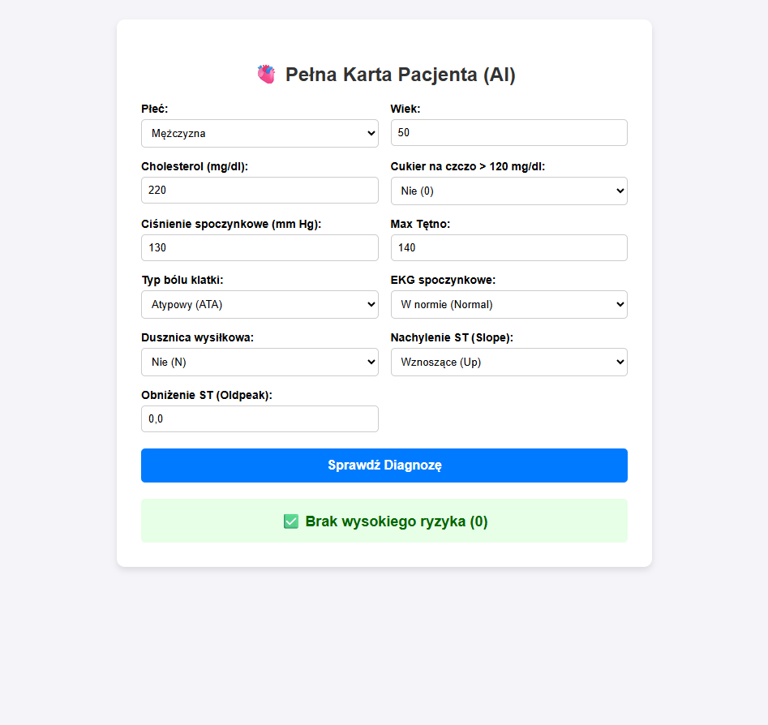

# 🫀 AI Kardiolog - System Predykcji Chorób Serca

W pełni skonteneryzowana aplikacja webowa wykorzystująca algorytmy uczenia maszynowego do oceny ryzyka wystąpienia chorób serca na podstawie wprowadzonych parametrów klinicznych.

## 🚀 O projekcie
Projekt to pełny obieg danych (Data Pipeline) i architektura mikrousług. Model uczenia maszynowego jest trenowany na danych pobieranych bezpośrednio z bazy danych, a następnie udostępniany światu za pomocą szybkiego API. Wszystko zamknięte jest w bezpiecznych kontenerach.

## 🛠️ Użyte Technologie
* **Machine Learning:** Skrypt trenujący własny model Drzewa Decyzyjnego (scikit-learn, pandas, numpy)
* **Backend API:** Python, FastAPI, Uvicorn, Pydantic
* **Baza Danych:** PostgreSQL (SQLAlchemy)
* **Frontend:** HTML5, CSS3, Vanilla JavaScript (Fetch API)
* **DevOps (Architektura):** Docker, Docker Compose

## ⚙️ Architektura Systemu
System składa się z dwóch niezależnych kontenerów Docker:
1. **baza-kardiologiczna (PostgreSQL):** Przechowuje dokumentację medyczną pacjentów używaną do trenowania modelu.
2. **kardiolog-api (FastAPI):** Serwer ładujący wytrenowany model (heart_model.pkl) i wystawiający endpoint /predict dla aplikacji klienckiej.

## 💻 Jak uruchomić projekt lokalnie?

Dzięki skonteneryzowaniu aplikacji, uruchomienie całego systemu wymaga tylko kilku kroków!

**Wymagania:** Zainstalowany program Docker Desktop oraz Git.

1. Sklonuj to repozytorium na swój komputer:
`git clone https://github.com/TwojNick/Nazwa-Twojego-Repo.git`

2. Wejdź do pobranego folderu i uruchom kontenery:
`docker compose up --build -d`

3. Otwórz plik index.html w dowolnej przeglądarce i przetestuj działanie systemu!

